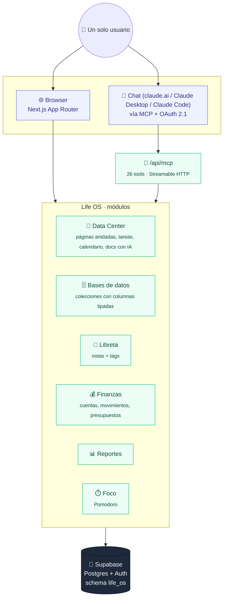

# Life OS

Plataforma personal de productividad — un "Notion propio" con tareas, notas,
finanzas y foco, pensada para uso diario de un solo usuario. Proyecto
personal / experimento, código abierto.

## Arquitectura

Una sola base de datos (Supabase/Postgres) detrás de dos puertas de entrada:
la app web de siempre, y un servidor MCP para operar todo desde un chat.



Las dos puertas (browser y chat) terminan en el mismo lugar: no hay datos
"solo para MCP" ni "solo para la app" — crear una tarea por chat la deja
visible al toque en `/data-center/tareas`, y viceversa.

## Módulos

- **Inicio**: dashboard del día — tareas pendientes, resumen financiero del
  mes, próximos eventos de Google Calendar (si está conectado), páginas y
  notas recientes, y acceso rápido a una sesión de foco.
- **Data Center**: páginas tipo Notion (editor de bloques, con subpáginas
  anidadas — árbol de páginas/carpetas sin límite de profundidad,
  reordenable arrastrando una página sobre otra o al nivel raíz — y un
  ícono/emoji por página) + tareas tipo Asana (proyectos, estados) +
  calendario de Google + generación de
  docs técnicas con IA + creación de PRs desde una tarea.
- **Libreta**: notas rápidas tipo journal, con tags y buscador. Pensada como
  PWA instalable para captura desde cualquier dispositivo.
- **Finanzas**: cuentas, movimientos, categorías, presupuestos y dashboard
  de gasto.
- **Reportes**: tendencia de ingresos/gastos de los últimos 6 meses,
  categorías con más gasto del período y estadísticas de productividad
  (tareas por estado, cantidad de páginas y notas).
- **Foco**: timer Pomodoro configurable + fondos ambientales (presets de
  color o tu propio embed de playlist/video), combinables en una "sesión de
  foco".
- **Bases de datos** (`/bases`): el equivalente a las databases de Notion —
  colecciones con columnas propias (texto, número, select, multi-select,
  fecha, checkbox, URL) y filas, para datos que no encajan en ningún otro
  módulo (listas de clientes, links, suites de producto, etc.).
- **MCP** (`/api/mcp`): Life OS se puede conectar como servidor MCP remoto
  desde un chat (claude.ai, Claude Desktop, Claude Code) para leer y crear
  tareas, páginas, notas y movimientos sin abrir la app. Ver la sección
  MCP más abajo.

## Stack

- **Next.js 16** (App Router, Turbopack por defecto) en Vercel.
- **Supabase**: Postgres + Auth (magic link) + Storage.
- **Drizzle ORM** sobre el Postgres de Supabase.
- **Tailwind CSS v4**. shadcn/ui se suma más adelante (ver nota abajo).
- **Yoopta-Editor** para el editor de bloques del Data Center y la Libreta —
  MIT, construido sobre Slate.js, exporta a Markdown/HTML. Soporta atajos
  tipo markdown (`# `, `## `, `- `, etc.) y de teclado (`Cmd+B`, `Cmd+I`, …),
  además de la barra flotante (al seleccionar texto: negrita, itálica,
  subrayado, tachado, código), el menú `/` (para insertar o convertir el
  bloque actual, incluidas imágenes y tablas) y las acciones flotantes por
  bloque (al pasar el mouse: agregar bloque debajo, arrastrar para
  reordenar, duplicar, eliminar) de `@yoopta/ui`. Las imágenes se suben a
  Supabase Storage (ver Storage más abajo).

## Roadmap

- **Fase 0 (hecho)**: scaffold del proyecto, Supabase auth (magic link),
  shell de navegación, manifest PWA básico, config de Drizzle.
- **Fase 1 (hecho)**: Data Center (páginas con editor de bloques + tareas
  tipo Asana con proyectos y estados) + Libreta (notas con tags y buscador)
  + Pomodoro configurable.
- **Fase 2 (hecho)**: Finanzas (cuentas, categorías, movimientos,
  presupuestos mensuales, resumen del mes) + Foco con fondos ambientales y
  playlist/video personalizables.
- **Fase 3 (hecho)**: generación de docs técnicas con IA (Claude API),
  creación de PRs desde una tarea (GitHub), conexión de Google Calendar
  (solo lectura de próximos eventos).
- **Data Center: páginas anidadas (hecho)**: cualquier página puede tener
  subpáginas (una "carpeta" es simplemente una página con hijas, igual que
  en Notion) — árbol expandible/colapsable en `/data-center`, breadcrumb y
  sección de subpáginas dentro de cada página.
- **Fase 4 (hecho)**: modo oscuro (toggle explícito, persistido en
  localStorage), dashboard de Inicio personalizable (mostrar/ocultar y
  reordenar widgets) y **Reportes** — nuevo módulo con tendencia de
  ingresos/gastos de los últimos 6 meses, categorías con más gasto del
  período y estadísticas de productividad (tareas por estado, cantidad de
  páginas y notas).
- **Fase 5 (hecho)**: servidor MCP remoto (`/api/mcp`) para conectar Life
  OS a un chat — tareas, páginas, notas y finanzas por conversación, sin
  abrir la app. Ver la sección MCP más abajo.

## Desarrollo local

```bash
npm install
cp .env.local.example .env.local  # completar con tu proyecto de Supabase
npm run dev
```

Life OS **comparte el proyecto de Supabase** de `behavioral-design-platform`
(por el límite de proyectos gratis) — no hace falta crear uno nuevo:

1. Auth → Providers → Email → confirmar que "magic link" esté habilitado
   (ya debería estarlo si esa app lo usa).
2. Auth → URL Configuration → **agregar** (sin borrar las existentes) a
   "Redirect URLs": `http://localhost:3000/auth/callback` y, cuando exista,
   la URL de producción de Vercel.
3. Copiar `Project URL` y `anon public key` (Project Settings → API) a
   `.env.local` — son los mismos valores que usa `behavioral-design-platform`.
4. Copiar el connection string del pooler (modo "Transaction", Project
   Settings → Database) a `DATABASE_URL`.

Las tablas de Life OS viven en su propio schema de Postgres (`life_os`, ver
`src/db/schema.ts`), separado del `public.projects` de la otra app — así que
compartir proyecto no mezcla los datos. Si más adelante esto crece y querés
separarlo del todo, migrar es un `pg_dump --schema=life_os` a un proyecto
nuevo.

## Base de datos

Las 17 tablas de Life OS (`life_os.projects`, `tasks`, `pages`, `notes`,
`accounts`, `categories`, `transactions`, `budgets`, `databases`,
`database_columns`, `database_rows`, `database_views`,
`page_database_links`, `undo_log`, `mcp_calls`,
`google_calendar_connections`) viven en `src/db/schema.ts` — detalle de
columnas, tipos y relaciones en
[docs/reference/database-schema.md](docs/reference/database-schema.md).
Si el proyecto de Supabase es nuevo, el schema todavía no está aplicado:
dos formas de hacerlo:

- **Rápido (una vez):** pegar el contenido de **todas** las migraciones,
  en orden, en Supabase → SQL Editor → New query, y correrlas (los nombres
  de archivo exactos y su orden están en `src/db/migrations/`). Mismo flujo
  que ya usás para `behavioral-design-platform/supabase/schema.sql`.
- **Con Drizzle (para cambios futuros de schema):** con `DATABASE_URL`
  cargado en `.env.local`, `npm run db:generate` genera la migración y
  `npm run db:migrate` la aplica.

## Storage (imágenes)

Las imágenes que se suben desde el editor de bloques (menú `/` → Imagen)
van a un bucket de Supabase Storage que **no** se crea con Drizzle (Storage
vive en el schema `storage`, gestionado por Supabase, no por nuestras
migraciones de Postgres). Correr una sola vez en Supabase → SQL Editor:

- Pegar y ejecutar el contenido de `supabase/storage-setup.sql`. Crea el
  bucket `life-os-uploads` (público, para poder renderizar ``
  directo) y dos policies que limitan subir/borrar archivos a la propia
  carpeta del usuario (`<user_id>/archivo.ext`), igual que el filtro manual
  por `user_id` que ya usan las server actions sobre Postgres.

Sin este paso, subir una imagen desde el editor falla (el bucket no existe
o falta la policy de `insert`).

## MCP

Life OS expone un servidor MCP remoto en `/api/mcp` (Streamable HTTP) para
conectarlo como una fuente más en un chat — leer tareas/páginas/notas,
crear una tarea ("procesos"), cargar un movimiento, etc., todo por
conversación en vez de la UI web.

**Setup (una vez):**

1. Generá un secreto largo: `openssl rand -hex 32`. Cargalo como
   `MCP_ACCESS_TOKEN` en Vercel (Environment Variables) y en tu
   `.env.local` si vas a probarlo en local. Este secreto cumple dos roles:
   es el Bearer token fijo para clientes que aceptan headers manuales
   (Claude Code CLI, config de Claude Desktop), y es también la clave con
   la que se firman los tokens del mini authorization server OAuth (ver
   más abajo) — no hace falta una env var extra para eso.
2. Si vas a usar el Bearer token fijo (no el flujo OAuth), buscá tu user
   id de Supabase Auth (Authentication → Users → tu usuario, es el UUID
   que aparece ahí) y cargalo como `MCP_USER_ID`, mismo lugar.
3. Redeployá (como con cualquier variable de entorno nueva, no toma efecto
   hasta el próximo deployment).

**Conectarlo desde claude.ai (web/Desktop)** — Settings → Connectors → Add
custom connector:

- Name: `Life OS`
- Remote MCP server URL: `https://tu-dominio.vercel.app/api/mcp`
- Click "Connect": claude.ai hace el flujo OAuth solo (descubre
  `/.well-known/oauth-authorization-server`, se registra, y abre una
  pestaña con la pantalla de consentimiento de Life OS). Si no tenés una
  sesión de Supabase activa en esa pestaña, te manda primero a `/login`
  (magic link) y vuelve automáticamente. No hay que pegar ningún header
  a mano — esa UI no lo permite, por eso existe el flujo OAuth (ver Notas
  técnicas).

**Conectarlo desde Claude Code CLI** (Bearer token fijo, sin OAuth):

```bash
claude mcp add --transport http life-os https://tu-dominio.vercel.app/api/mcp \
  --header "Authorization: Bearer <tu MCP_ACCESS_TOKEN>"
```

**Qué puede hacer hoy:** listar/crear/actualizar/borrar tareas y
proyectos, listar/crear/actualizar/borrar páginas y notas (contenido en
texto plano — el editor de bloques con formato rico solo funciona desde
la app), leer/crear cuentas, categorías, movimientos y el resumen
financiero del mes, y leer/crear/actualizar/borrar bases de datos
genéricas (columnas y filas de `/bases`). Ver Notas técnicas para el
detalle de por qué no soporta formato rico ni reportes todavía, y
[docs/reference/mcp-tools.md](docs/reference/mcp-tools.md) para las 26
tools una por una (nombre, parámetros, si son de solo lectura).

## Deploy en Vercel

1. Importar este repo en [vercel.com/new](https://vercel.com/new).
2. Cargar las mismas variables de entorno de `.env.local.example` en
   Project Settings → Environment Variables (`NEXT_PUBLIC_SITE_URL` con la
   URL real de producción).
3. En Supabase, Auth → URL Configuration → agregar la URL de Vercel a
   "Redirect URLs" (`https://tu-dominio.vercel.app/auth/callback`).

## Notas técnicas

- **Servidor MCP** (`src/app/api/mcp/route.ts`): usa `mcp-handler`
  (`createMcpHandler` + `withMcpAuth`) sobre `@modelcontextprotocol/server`,
  con transporte Streamable HTTP stateless (sin sesiones — cada request es
  autocontenido, más simple de escalar en serverless que el modo con
  `sessionIdGenerator`). Auth por un solo Bearer token fijo
  (`MCP_ACCESS_TOKEN`, comparado en tiempo constante con
  `crypto.timingSafeEqual`) en vez de un flujo OAuth completo — mismo
  criterio que `GITHUB_TOKEN`: Life OS es de un solo usuario, no vale la
  pena un authorization server propio. El `userId` autorizado
  (`MCP_USER_ID`) viaja en el `AuthInfo.extra` que arma `verifyMcpToken`
  (`src/lib/mcp/auth.ts`) y es lo que cada tool usa para filtrar sus
  queries — no hay sesión de cookies acá, así que las tools **no**
  reusan las server actions existentes (`requireUser()` depende de
  cookies de Supabase); tienen su propia lógica de acceso a Drizzle en
  `src/lib/mcp/tools/*.ts`, aceptando algo de duplicación con
  `actions.ts` a cambio de no arriesgar una refactorización grande de
  código ya en producción. `/api/mcp` está explícitamente afuera del
  chequeo de sesión de `proxy.ts` (agregado a `PUBLIC_PATHS`) — si no,
  el middleware redirige cualquier request sin cookie a `/login` antes
  de que la auth propia del MCP (`withMcpAuth`) llegue a correr.
  El contenido de páginas/notas creado desde acá se guarda como bloques
  `Paragraph` armados a mano (`src/lib/mcp/block-content.ts`, un párrafo
  por línea en blanco) porque `markdown.deserialize` de `@yoopta/exports`
  necesita `DOMParser` — no corre en una route serverless, mismo motivo
  por el que `generate-doc-form.tsx` hace esa conversión en el cliente.
  Sin reportes todavía (`reportes/actions.ts` también depende de
  `requireUser()`) — se puede sumar más adelante duplicando su lógica de
  agregación, como se hizo con el resto.
- **Mini authorization server OAuth** (`src/app/api/mcp/oauth/*`,
  `src/app/.well-known/oauth-*`): claude.ai (y otros clientes MCP
  "remotos") no ofrecen forma de pegar un Bearer token a mano al agregar
  un connector — fuerzan el flujo OAuth 2.1 con PKCE del spec de MCP. En
  vez de implementar un authorization server completo con base de datos,
  los authorization codes y access tokens son **stateless**: JSON firmado
  con HMAC-SHA256 usando `MCP_ACCESS_TOKEN` como clave
  (`src/lib/mcp/oauth-tokens.ts`), sin tabla nueva ni refresh tokens (el
  access token dura 90 días). La registración dinámica de clientes
  (`/api/mcp/oauth/register`, RFC 7591) no persiste nada — devuelve un
  `client_id` cualquiera y no se vuelve a chequear —, así que la
  seguridad real pasa por dos cosas: (1) la pantalla de consentimiento en
  `/api/mcp/oauth/authorize` exige una sesión de Supabase real (reusa el
  login por magic link existente, con un `?next=` que ahora
  `login/actions.ts` y `login/page.tsx` saben propagar), y (2) una
  allowlist de hosts de `redirect_uri` (`oauth-redirect-allowlist.ts`,
  hoy `claude.ai`/`claude.com`/`localhost`) para que nadie arme un link
  de authorize con un redirect propio y se robe el código si el usuario
  lo aprueba sin fijarse. El Bearer token fijo (`MCP_ACCESS_TOKEN` +
  `MCP_USER_ID`) sigue funcionando en paralelo — `verifyMcpToken`
  (`src/lib/mcp/auth.ts`) acepta cualquiera de los dos.
- **Modo oscuro**: toggle explícito en el sidebar (`theme-toggle.tsx`),
  persistido en `localStorage` (`life-os:theme`) y aplicado como
  `data-theme="dark"` en `<html>`. Un script inline al principio del
  `<body>` (`layout.tsx`) aplica el tema guardado antes del primer paint,
  para no flashear el tema claro. La implementación NO usa el variant
  `dark:` de Tailwind ni retoca componente por componente: redefine en
  `globals.css`, bajo `[data-theme="dark"]`, las custom properties que
  Tailwind v4 ya usa internamente para sus utilidades de color
  (`--color-neutral-*`, `--color-white`, etc. — confirmado leyendo el CSS
  compilado, que referencia `var(--color-neutral-50)` en vez de un valor
  fijo). Como toda la app usa la escala `neutral-*` de forma consistente,
  invertirla completa resuelve cards, bordes, texto y hovers de toda la
  UI sin tocar un solo componente; los acentos de color (blue/green/red)
  se ajustan a variantes con contraste sobre fondo oscuro en vez de
  invertirse. Si agregás un color nuevo a algún componente, sumale su
  equivalente oscuro en ese mismo bloque de `globals.css`.
- Next.js 16 renombró `middleware.ts` a `proxy.ts` — vive en `src/proxy.ts`
  (no en la raíz) por usar `--src-dir`. Se encarga de refrescar la sesión
  de Supabase y redirigir a `/login` si no hay usuario.
- `cookies()`, `params` y `searchParams` son siempre async en esta versión.
- El CLI de `shadcn` no pudo correr en el entorno donde se armó el scaffold
  inicial (proxy de red bloqueaba `ui.shadcn.com`). Los componentes se
  pueden sumar después con `npx shadcn add <componente>` desde un entorno
  con esa red disponible.
- El ícono de `public/icon.svg` es un placeholder — conviene reemplazarlo
  por un ícono real (y sumar versiones PNG 192/512 para mejor soporte en
  iOS) antes de instalar la PWA en el celular.
- `@yoopta/image` y `@yoopta/table` están integrados. La subida de imágenes
  (`src/lib/uploads.ts`, server action `uploadBlockImage`) va a un bucket de
  Supabase Storage — ver la sección Storage más arriba para el setup
  manual del bucket/policies. El wrapper `handleImageUpload` en
  `yoopta-plugins.ts` existe porque el plugin llama
  `upload(file, onProgress)` del lado del cliente y una función no se puede
  pasar como argumento a una server action (no es serializable); el
  wrapper la descarta antes de invocar la server action con solo el
  archivo. No hay borrado de storage al eliminar un bloque de imagen
  (archivo huérfano queda en el bucket) — aceptable para un uso personal,
  documentado como pendiente si hace falta más adelante.
- El tipo de `Table` (`@yoopta/table`) necesita un cast (`as unknown as
  YooptaPlugin<...>`) en `yoopta-plugins.ts` para entrar en el array de
  plugins — es una limitación de los tipos del paquete (su `children`
  interno referencia sus propias 3 claves de elemento, algo que no colapsa
  bien al tipo genérico que espera `createYooptaEditor`), no afecta el
  comportamiento en runtime.
- `@yoopta/ui` está integrado para `FloatingToolbar` (marks al seleccionar
  texto), `SlashCommandMenu` (menú `/` para insertar/convertir bloques) y
  `FloatingBlockActions` + `BlockOptions` + `block-dnd` (al pasar el mouse
  sobre un bloque: "+" para agregar uno debajo, "⠿" para arrastrar y
  reordenar, "⋯" abre un menú con Duplicar/Eliminar) — ver
  `block-editor-toolbar.tsx`, `block-editor-slash-menu.tsx` y
  `block-editor-block-actions.tsx`. Son componentes compuestos (patrón
  Root/Content/Item, no un drop-in) que se montan como `children` de
  `<YooptaEditor>`. El drag-and-drop en sí lo maneja
  `BlockEditor` (`block-editor.tsx`): envuelve todo en `BlockDndContext` y
  usa `renderBlock` para envolver cada bloque en `SortableBlock`; el "⠿"
  es el `DragHandle` que dispara el arrastre.
- El árbol de páginas (`page-tree.tsx`) también tiene drag-and-drop, pero
  para reparentar páginas (no para reordenar bloques) — usa la API nativa
  de HTML5 del navegador (`draggable`, eventos `onDragStart/Over/Drop`),
  no `@dnd-kit`. Soltar una página sobre otra la convierte en subpágina;
  una zona punteada aparte ("Soltar acá para mover al nivel raíz", visible
  solo mientras hay un drag en curso) la vuelve top-level. La acción
  `movePage` valida ciclos en el servidor (no se puede mover una página
  dentro de sí misma o de una de sus propias subpáginas) y la UI también
  bloquea esos drops visualmente. No soporta touch ni teclado — aceptable
  para un uso mayormente de escritorio.
- Cada página puede tener un ícono (`page-icon-picker.tsx`): un popover
  casero con una grilla de emoji comunes + un campo de texto para pegar
  cualquier otro (no hay librería de emoji-picker, ni upload de imagen
  como ícono). Sin ícono elegido se muestra "📄" como fallback en el
  árbol, el breadcrumb y la lista de subpáginas.
- Todas las queries a la base pasan por Drizzle con conexión directa a
  Postgres (`DATABASE_URL`), no por la REST API de Supabase — o sea que las
  políticas de RLS (si algún día se agregan) NO protegen estas tablas. Cada
  server action en `actions.ts` filtra a mano por `user_id` del usuario
  autenticado; cualquier query nueva tiene que seguir ese mismo patrón.
- **Finanzas** guarda los montos en centavos (`amount_cents`, integer con
  signo: positivo = ingreso, negativo = gasto) para no arrastrar errores de
  punto flotante. Se asume una sola moneda (ARS por defecto en `accounts`);
  no hay conversión entre monedas.
- **Dashboard de Inicio personalizable** (`dashboard-widgets.tsx`):
  mostrar/ocultar cada widget y reordenarlos con botones ↑/↓ (no
  drag-and-drop acá — con 6 widgets alcanza y sobra, no vale la pena
  reimplementar el patrón nativo de `page-tree.tsx` para una lista tan
  corta). Preferencia en `localStorage` (`life-os:dashboard-widgets`,
  `{ order, hidden }`); el server component (`page.tsx`) sigue trayendo
  los datos de cada módulo en paralelo, el cliente solo decide qué mostrar
  y en qué orden.
- **Reportes** (`/reportes`) no agrega tablas nuevas: agrega datos ya
  existentes de `transactions` (tendencia mensual y categorías, agrupando
  por `to_char(occurred_at, 'YYYY-MM')`) y cuenta filas de `tasks` por
  estado, `pages` y `notes`. Rango fijo de 6 meses (`MONTHS_BACK`).
- **Foco** no trae una playlist de jazz ni un video de yoga precargados a
  propósito — el link de un video o playlist específico no es información
  que se pueda inventar de forma confiable (puede no existir, cambiar o no
  ser el gusto del usuario). En cambio, `FocusAmbience`
  (`src/components/focus-ambience.tsx`) deja pegar cualquier link de
  Spotify o YouTube (audio y/o video, por separado) más presets de color
  con CSS puro que no dependen de ningún link externo. Todo se guarda en
  `localStorage`, no en la base.
- **Generar con IA** usa `claude-opus-5` vía `@anthropic-ai/sdk`, sin
  streaming (la respuesta es corta, 1-2 páginas de Markdown, `max_tokens:
  4096`). El Markdown se convierte a bloques de Yoopta **en el cliente**
  (`markdown.deserialize` de `@yoopta/exports` necesita `DOMParser`, no
  corre en Node) — por eso `generate-doc-form.tsx` arma un editor temporal
  en el browser solo para la conversión, y recién ahí llama a
  `createPageWithContent`.
- **Crear PR** usa un Personal Access Token de GitHub (`GITHUB_TOKEN`), no
  una GitHub App con OAuth. Para una herramienta de un solo usuario, un PAT
  fine-grained (scope Contents + Pull requests, limitado a los repos que
  uses) es mucho más simple que registrar una App — si algún día esto pasa
  a multiusuario, ahí sí conviene migrar a OAuth App. El botón crea una
  rama, comitea un archivo `life-os-tasks/<id>.md` con el título/descripción
  de la tarea (GitHub no deja abrir un PR sin al menos un commit de
  diferencia con la base) y abre el PR como draft — es un punto de partida
  para laburar, no un PR "terminado".
- **Google Calendar** es de solo lectura (scope
  `calendar.readonly`) y usa un flow de OAuth propio (`src/lib/
  google-calendar.ts` + las rutas bajo `src/app/api/google-calendar/`) —
  independiente de cualquier conector de Google que uses vos como usuario
  en otro contexto. Guarda `access_token`/`refresh_token` en la tabla
  `google_calendar_connections` y refresca el token solo cuando está por
  vencer. Google solo manda `refresh_token` la primera vez que autorizás
  la app — si reconectás sin haber revocado el acceso antes en
  myaccount.google.com/permissions, el callback lo detecta y avisa.
